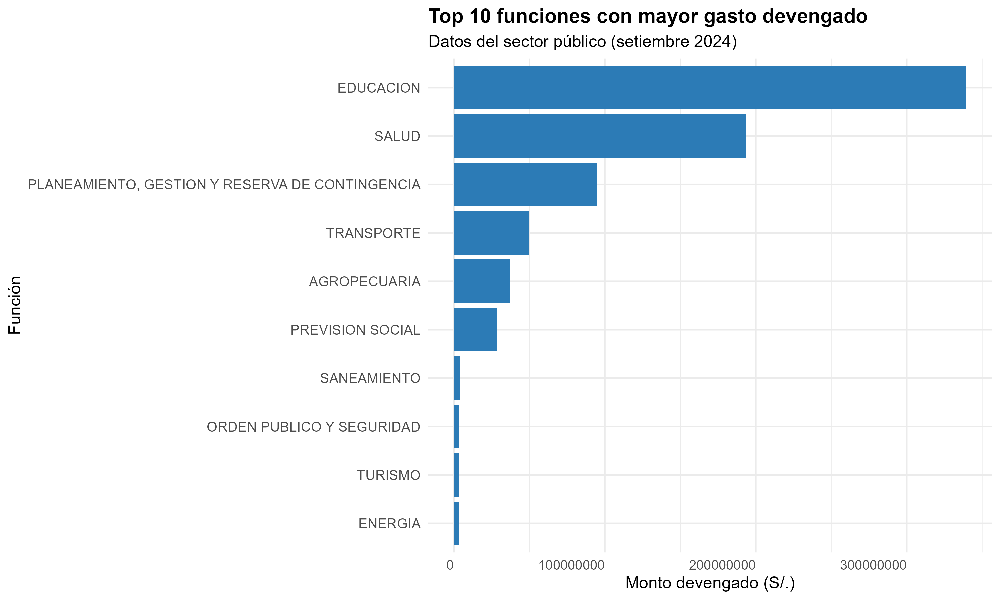
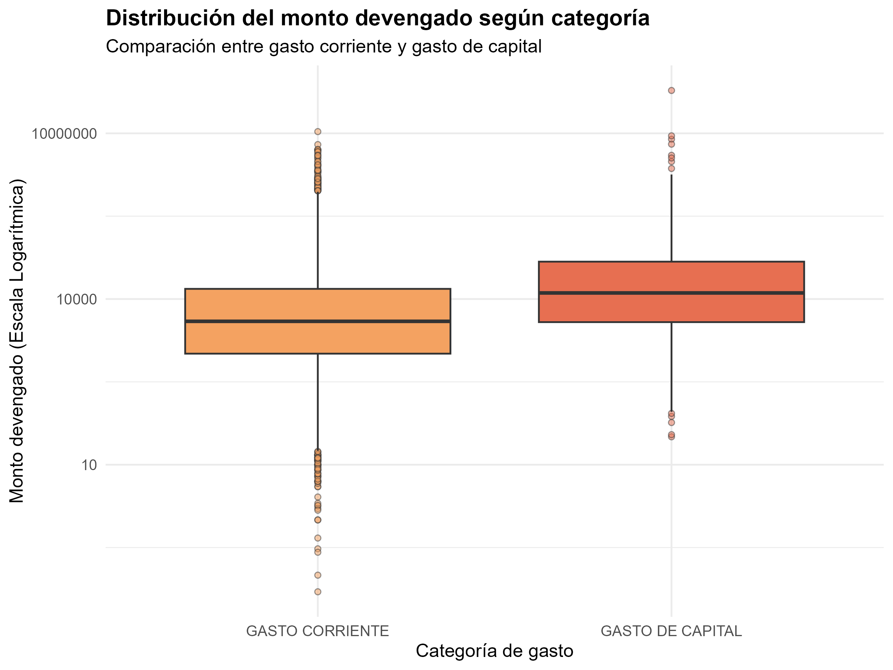
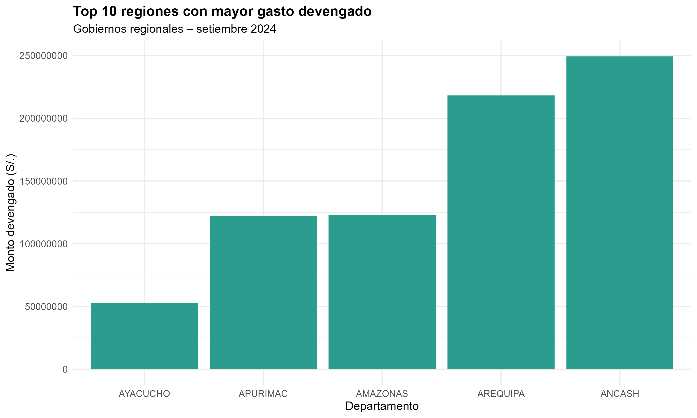

<h1 align="center"> <b>UNIVERSIDAD NACIONAL AGRARIA LA MOLINA</b> </h1>

<h2 align="center"> <b>DEPARTAMENTO ACADÉMICO DE ESTADÍSTICA E INFORMÁTICA</b> </h2>

<p align="center">
  
</p>

<h3 align="center">
  <b>ANÁLISIS DESCRIPTIVO E INFERENCIAL DE LA EJECUCIÓN DEL GASTO PÚBLICO EN EL PERÚ DURANTE SEPTIEMBRE DE 2024 CON DATOS ABIERTOS DEL MEF</b>
</h3>

<hr>

<h3> <b>Integrantes del equipo:</b> </h3>

<ul>
  <li>Cárdenas Panduro, Ricardo Gabriel (Rick2425) (20241376)</li>
  <li>Almonacid Quispe, Jimmy Salomón (patatita1theoriginal) (20241374)</li>
  <li>Tuppia Paitan, Joaquin Francisco (JTPXD) (20241405)</li>
  <li>Ortiz Huamani, Ricardo Fidel (ricardofortizh) (20240724)</li>
</ul>

<hr>

<h2>Descripción del proyecto</h2>

<p>
Este proyecto integrador desarrolla un análisis descriptivo e inferencial sobre la ejecución del gasto público en el Perú durante septiembre de 2024, utilizando datos abiertos del Ministerio de Economía y Finanzas (MEF). El trabajo integra extracción de datos mediante API, programación orientada a objetos, limpieza y normalización de datos, procesamiento con pandas, generación de indicadores, visualización de información y documentación colaborativa mediante GitHub.
</p>

<p>
La variable principal del análisis es el <b>monto devengado</b>, entendido como el gasto reconocido como obligación de pago. Además, se considera la <b>tasa de giro</b> como indicador complementario para aproximar el avance financiero posterior al devengado.
</p>

<hr>

<h2>Objetivos del proyecto</h2>

<h3>Objetivo general</h3>

<p>
Analizar descriptiva e inferencialmente la ejecución del gasto público en el Perú durante septiembre de 2024, utilizando datos abiertos del Ministerio de Economía y Finanzas, con el propósito de identificar diferencias en los montos devengados y niveles de avance financiero según sector, nivel de gobierno, departamento, función y fuente de financiamiento.
</p>

<h3>Objetivos específicos</h3>

<ol>
  <li>
    Describir la distribución del gasto público ejecutado durante septiembre de 2024, considerando variables como sector, nivel de gobierno, departamento ejecutor, función del gasto y fuente de financiamiento.
  </li>

  <li>
    Estimar parámetros estadísticos del gasto público, como la media, mediana, dispersión e intervalos de confianza del monto devengado y de la tasa de giro.
  </li>

  <li>
    Comparar la ejecución del gasto público entre distintos grupos institucionales y territoriales, evaluando si existen diferencias significativas según sector, nivel de gobierno o departamento ejecutor.
  </li>

  <li>
    Visualizar la frecuencia y concentración de los registros presupuestales, identificando los sectores, funciones y fuentes de financiamiento con mayor presencia en la ejecución del gasto público.
  </li>
</ol>

<hr>

<h2>Fuente de datos</h2>

<p>
Los datos provienen de la API de Datos Abiertos del Ministerio de Economía y Finanzas del Perú. La extracción se realizó mediante solicitudes HTTP con la librería <code>requests</code> de Python.
</p>

<ul>
  <li><b>Entidad fuente:</b> Ministerio de Economía y Finanzas del Perú.</li>
  <li><b>Tipo de fuente:</b> API pública de datos abiertos.</li>
  <li><b>Método de acceso:</b> solicitud HTTP tipo GET.</li>
  <li><b>Formato de respuesta:</b> JSON.</li>
  <li><b>Periodo analizado:</b> septiembre de 2024.</li>
  <li><b>Variable principal:</b> monto devengado.</li>
</ul>

<hr>

<h2>Metodología general</h2>

<p>
El flujo de trabajo del proyecto fue dividido en cinco roles principales:
</p>

<ol>
  <li>
    <b>Extracción de datos:</b> se construyó un extractor en Python usando Programación Orientada a Objetos para conectarse a la API del MEF, descargar registros y guardar una base cruda.
  </li>

  <li>
    <b>Limpieza, transformación y validación:</b> se aplicó un proceso de depuración en R para normalizar nombres de columnas, limpiar textos, convertir variables numéricas, filtrar septiembre de 2024 y construir una base final de análisis.
  </li>

  <li>
    <b>Análisis con pandas e indicadores:</b> se generaron resúmenes por sector, región y nivel de gobierno, calculando el gasto total devengado y la tasa promedio de giro.
  </li>

  <li>
    <b>Visualización de resultados:</b> se elaboraron gráficos para identificar las funciones, categorías de gasto y regiones con mayor concentración presupuestal.
  </li>

  <li>
    <b>Integración, GitHub, documentación y presentación:</b> se organizó el repositorio, se documentó el proyecto y se preparó la evidencia final para la sustentación.
  </li>
</ol>

<hr>

<h2>Tecnologías utilizadas</h2>

<ul>
  <li><b>Python:</b> extracción de datos, procesamiento y análisis.</li>
  <li><b>R:</b> limpieza, transformación y visualización.</li>
  <li><b>requests:</b> conexión HTTP con la API del MEF.</li>
  <li><b>pandas:</b> manipulación y análisis de datos tabulares.</li>
  <li><b>numpy:</b> apoyo en operaciones numéricas.</li>
  <li><b>matplotlib:</b> visualización de datos en Python.</li>
  <li><b>data.table:</b> lectura y procesamiento eficiente en R.</li>
  <li><b>tidyverse / dplyr:</b> manipulación de datos en R.</li>
  <li><b>ggplot2:</b> elaboración de gráficos.</li>
  <li><b>Git y GitHub:</b> control de versiones y trabajo colaborativo.</li>
  <li><b>Jupyter Notebook:</b> integración reproducible del análisis.</li>
</ul>


<h2>Estructura del repositorio</h2>

<p>
El repositorio fue organizado por roles para mostrar de forma clara la participación del equipo y la secuencia del proceso de análisis.
</p>

```txt
Trabajo-final-LP2-Practica/
│
├── Rol_1_Extraccion_de_datos_con_API_del_MEF/
│   ├── ExtractorMEF.py
│   ├── README.md
│   └── csv_crudo.zip
│
├── Rol_2_Limpieza_transformacion_y_validacion_/
│   ├── Limpieza y normalización.r
│   ├── README.md
│   └── gasto_publico_limpio_inferencia.csv
│
├── Rol_3_Analisis_con_pandas_e_indicadores/
│   ├── README.md
│   ├── analizador_gasto.py
│   ├── ranking_sectores.csv
│   ├── resumen_nivel_gobierno.csv
│   ├── resumen_region.csv
│   └── resumen_sector.csv
│
├── Rol_4_Visualizacion_de_resultados/
│   ├── README.md
│   ├── Visualizacion.R
│   ├── grafico1_top_funciones.png
│   ├── grafico2_boxplot_monto.png
│   └── grafico3_top_regiones.png
│
└── Rol_5_Integracion_GitHub_documentacion_y_presentacion/
    └── README.md
```

<hr>

<h2>Flujo de ejecución del proyecto</h2>

<h3>1. Extracción de datos desde la API del MEF</h3>

<p>
Se ejecuta el extractor desarrollado en Python:
</p>

```bash
python Rol_1_Extraccion_de_datos_con_API_del_MEF/ExtractorMEF.py
```

<p>
Este script se conecta a la API del MEF, realiza solicitudes HTTP, extrae registros en formato JSON y los guarda como archivo CSV crudo.
</p>

<h3>2. Limpieza y normalización de datos</h3>

<p>
Luego se ejecuta el script de limpieza en R:
</p>

```txt
Rol_2_Limpieza_transformacion_y_validacion_/Limpieza y normalización.r
```

<p>
Este proceso filtra los registros correspondientes a septiembre de 2024, normaliza textos, convierte variables numéricas, elimina datos inconsistentes y genera la base limpia:
</p>

```txt
Rol_2_Limpieza_transformacion_y_validacion_/gasto_publico_limpio_inferencia.csv
```

<h3>3. Análisis con pandas e indicadores</h3>

<p>
Posteriormente se ejecuta el analizador en Python:
</p>

```bash
python Rol_3_Analisis_con_pandas_e_indicadores/analizador_gasto.py
```

<p>
Este archivo genera tablas resumen por sector, departamento y nivel de gobierno.
</p>

<h3>4. Visualización de resultados</h3>

<p>
Finalmente se ejecuta el script de visualización:
</p>

```txt
Rol_4_Visualizacion_de_resultados/Visualizacion.R
```

<p>
Este proceso genera los gráficos principales del proyecto.
</p>

<hr>

<h2>Variables consideradas</h2>

<table>
  <tr>
    <th>Variable</th>
    <th>Descripción</th>
  </tr>

  <tr>
    <td><code>ano_eje</code></td>
    <td>Año de ejecución presupuestal.</td>
  </tr>

  <tr>
    <td><code>mes_eje</code></td>
    <td>Mes de ejecución presupuestal.</td>
  </tr>

  <tr>
    <td><code>nivel_gobierno_nombre</code></td>
    <td>Nivel de gobierno responsable de la ejecución.</td>
  </tr>

  <tr>
    <td><code>sector_nombre</code></td>
    <td>Sector institucional asociado al registro presupuestal.</td>
  </tr>

  <tr>
    <td><code>departamento_ejecutora_nombre</code></td>
    <td>Departamento de la unidad ejecutora.</td>
  </tr>

  <tr>
    <td><code>funcion_nombre</code></td>
    <td>Función del gasto público.</td>
  </tr>

  <tr>
    <td><code>fuente_financiamiento_nombre</code></td>
    <td>Fuente de financiamiento del gasto.</td>
  </tr>

  <tr>
    <td><code>categoria_gasto_nombre</code></td>
    <td>Categoría del gasto, como gasto corriente o gasto de capital.</td>
  </tr>

  <tr>
    <td><code>monto_devengado</code></td>
    <td>Monto reconocido como obligación de pago.</td>
  </tr>

  <tr>
    <td><code>tasa_giro</code></td>
    <td>Relación porcentual entre el monto girado y el monto devengado.</td>
  </tr>
</table>

<hr>

<h2>Resultados obtenidos</h2>

<p>
A partir de la base procesada del gasto público correspondiente a septiembre de 2024, se obtuvieron tablas resumen y gráficos que permiten identificar la concentración del monto devengado según funciones, categorías de gasto y departamentos ejecutores.
</p>

<h3>1. Top 10 funciones con mayor gasto devengado</h3>

<p align="center">
  
</p>

<p>
El gráfico muestra que la función <b>Educación</b> concentra el mayor monto devengado durante septiembre de 2024. En segundo lugar aparece <b>Salud</b>, seguida por <b>Planeamiento, Gestión y Reserva de Contingencia</b>. Esta distribución evidencia que el gasto público del periodo se orientó principalmente hacia servicios esenciales y funciones administrativas del Estado.
</p>

<p>
También se observa una diferencia marcada entre las primeras funciones y el resto. Esto sugiere una concentración del gasto en pocas áreas funcionales, lo que puede relacionarse con la prioridad presupuestal asignada a educación, salud y gestión pública durante el periodo evaluado.
</p>

<h3>2. Distribución del monto devengado según categoría de gasto</h3>

<p align="center">
  
</p>

<p>
El boxplot compara la distribución del monto devengado entre <b>gasto corriente</b> y <b>gasto de capital</b>. Al utilizar una escala logarítmica, se puede observar mejor la dispersión de los montos, ya que los registros presupuestales presentan valores pequeños, medianos y valores extremos altos.
</p>

<p>
El <b>gasto de capital</b> presenta una mediana superior y una dispersión considerable, lo cual puede asociarse a proyectos de inversión pública, infraestructura u otros gastos de mayor escala. Por otro lado, el <b>gasto corriente</b> concentra una mayor cantidad de registros de menor monto, aunque también presenta valores extremos. Esto refleja la existencia de pagos operativos frecuentes y algunos desembolsos elevados.
</p>

<h3>3. Top regiones con mayor gasto devengado</h3>

<p align="center">
  
</p>

<p>
El gráfico regional muestra que <b>Áncash</b> y <b>Arequipa</b> presentan los mayores montos devengados entre las regiones mostradas. Luego aparecen departamentos como <b>Amazonas</b>, <b>Apurímac</b> y <b>Ayacucho</b>.
</p>

<p>
Estas diferencias territoriales permiten observar que la ejecución del gasto no se distribuye de manera homogénea entre departamentos. Las regiones con mayores montos podrían estar asociadas a mayor cantidad de proyectos, mayor presupuesto asignado, mayor capacidad de ejecución o necesidades específicas durante el mes analizado. Sin embargo, para explicar las causas con mayor precisión sería necesario incorporar variables adicionales como población, presupuesto institucional modificado, número de unidades ejecutoras y tipo de proyectos ejecutados.
</p>

<hr>

<h2>Interpretación general</h2>

<p>
Los resultados indican que el gasto público devengado durante septiembre de 2024 presenta una concentración importante por función y por departamento. Educación y Salud aparecen como funciones prioritarias, mientras que determinadas regiones concentran montos superiores dentro del conjunto analizado.
</p>

<p>
Desde el punto de vista estadístico, el monto devengado muestra alta dispersión y presencia de valores extremos, por lo que resulta adecuado emplear gráficos como boxplots con escala logarítmica. Además, la tasa de giro permite complementar el análisis, ya que relaciona el monto efectivamente girado con el monto devengado.
</p>

<p>
En conjunto, el proyecto demuestra la aplicación integrada de programación orientada a objetos, consumo de API, programas en red, expresiones regulares, procesamiento con pandas, visualización de datos y documentación mediante GitHub.
</p>

<hr>

<h2>Resumen</h2>

<table>
  <tr>
    <th>Requisito</th>
    <th>Aplicación en el proyecto</th>
  </tr>

  <tr>
    <td>Programación Orientada a Objetos</td>
    <td>Se implementaron clases para la configuración, extracción de datos, escritura de archivos y análisis de indicadores.</td>
  </tr>

  <tr>
    <td>Programas en red</td>
    <td>Se utilizó <code>requests</code> para realizar solicitudes HTTP a la API del MEF.</td>
  </tr>

  <tr>
    <td>API o Web Scraping</td>
    <td>Se consumió una API pública de datos abiertos del Ministerio de Economía y Finanzas.</td>
  </tr>

  <tr>
    <td>Expresiones regulares</td>
    <td>Se aplicaron procesos de limpieza y normalización de nombres de columnas, textos y valores numéricos.</td>
  </tr>

  <tr>
    <td>Procesamiento con pandas</td>
    <td>Se generaron tablas resumen por sector, región y nivel de gobierno.</td>
  </tr>

  <tr>
    <td>Visualización</td>
    <td>Se elaboraron gráficos de barras y boxplots para interpretar los resultados.</td>
  </tr>

  <tr>
    <td>Git y GitHub</td>
    <td>El proyecto fue desarrollado y organizado en un repositorio colaborativo por roles.</td>
  </tr>
